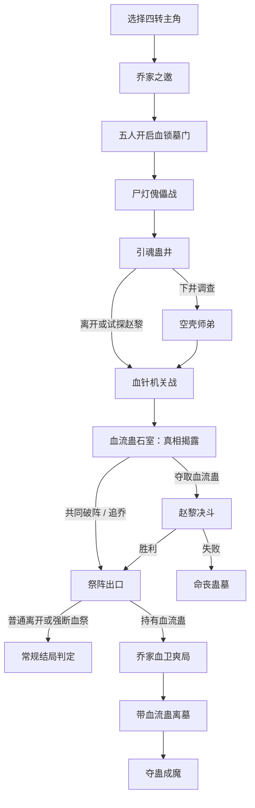

# 《蛊墓五修》剧情大纲与全流程

> 版本定位：固定剧本、状态驱动的文字 RPG。每局选择一名主角后，剧情文本、节点、战斗、数值与结局不会再被 AI 改写。

## 1. 世界与规则

### 1.1 蛊虫等级

蛊虫分为一转至九转：一转最弱，九转最强。

- 玩家与四名同行者均为 **四转蛊修**。
- 墓中目标为一只死去的 **五转血流蛊**。
- 乔家秘卷仅知血流蛊能让血气如江河般奔涌，具体威能未知。
- 夺蛊成功后的实战效果：血流蛊可造成 **16 点伤害**，并恢复等量生命。

### 1.2 乔家邀请的表面理由

乔家家主乔无咎邀请五名四转蛊修入墓，承诺由众人合力：

1. 开启血锁墓门；
2. 破解墓中机关；
3. 探索墓室、寻找遗物；
4. 按各自功劳分配乔家许诺的好处。

### 1.3 真相

乔无咎其实已掌握墓穴约七成情报。他需要四名外来四转蛊修与自己的乔家血脉共同组成五人血祭，复活死去的血流蛊。

他会在墓穴中段消失，改为在暗处操控乔家血针机关，让众人消耗、流血并踏入祭阵。

---

## 2. 登场人物

| 人物 | 身份与外在形象 | 真实目的与秘密 | 当前剧情作用 |
| --- | --- | --- | --- |
| 玩家 | 三选一的四转蛊修 | 由玩家决定 | 以属性、选择与战斗决定结局 |
| 沈青萝 | 龙山门貌美女修 | 师弟沈砚在此死亡，她来调查真相 | 可建立信任；掌握与引魂蛊、玉牌有关的线索 |
| 赵黎 | 年轻外貌的散修，却总自称“老夫” | 隐藏实力的四转邪修，实为在场最强者，只图利益 | 夺蛊路线的决斗对手；战败会导致玩家死亡 |
| 贾贵 | 笑眯眯的胖散修 | 只想保命与获利，擅长保命 | 以金壳蛊承担防御，大部分路线会活到最后 |
| 乔无咎 | 势力庞大的乔家家主 | 以众人为祭，复活血流蛊 | 邀请者、机关操纵者与血祭阴谋的核心 |

### 2.1 可选主角

| 主角 | 身份 | 初始优势 | 本命蛊 |
| --- | --- | --- | --- |
| 宁素衣 | 四转游方蛊医 | 神识 3，可识破墓门蛊纹 | 回春蛊 |
| 陆照野 | 四转散修剑客 | 生命与攻击最高，蛊斗更强 | 血刃蛊 |
| 顾微尘 | 四转世家旁支 | 声望 3，可在部分交涉中获得特殊线索 | 惑心蛊 |

---

## 3. 持续状态

| 状态 | 作用 |
| --- | --- |
| 生命 | 归零不会立刻结束普通战斗，而会变为重伤、生命降至 1；赵黎夺蛊决斗是例外，战败后进入死亡结局。 |
| 真元 | 用于部分叙事抉择，例如护住沈青萝或强断血祭。 |
| 时辰 | 快速推进、探索和普通战败会累积；达到 4 时优先进入困墓结局。 |
| 线索 | 用于理解血祭、调查沈砚死因、达成共同出墓。 |
| 信任 | 当前主要记录沈青萝与乔无咎；沈青萝信任影响共同出墓。 |
| 标记 | 记录重伤、血流蛊归属、机关是否破除等永久结果。 |

---

## 4. 主流程

---

## 5. 节点与全部选项

### 5.1 壹 · 乔家之邀：五名四转蛊修

乔无咎说明报酬与分工，沈青萝、赵黎、贾贵首次亮相。

| 选择 | 前置 | 后果 | 前往 |
| --- | --- | --- | --- |
| 察看墓门蛊纹 | 神识 ≥ 2 | 获得「五人血印」 | 五人开门 |
| 相信乔家承诺 | 无 | 乔无咎信任 +1 | 五人开门 |
| 独自先行勘探 | 无 | 时辰 +1，获得「独行」 | 五人开门 |

### 5.2 贰 · 五人开门：血锁墓门

五人合力开启血锁：沈青萝以青藤蛊稳阵、贾贵以金壳蛊护身、赵黎轻易震碎最难的血锁，暴露出不符合普通散修的实力。

| 选择 | 后果 | 前往 |
| --- | --- | --- |
| 记下赵黎未掩饰的实力 | 获得「赵黎藏实力」 | 尸灯傀儡战 |
| 护住沈青萝侧翼 | 沈青萝信任 +1 | 尸灯傀儡战 |
| 催促众人冲过墓道 | 时辰 +1 | 尸灯傀儡战 |

### 5.3 叁 · 尸灯傀儡：四转合战

尸灯傀儡来袭。沈青萝控场、贾贵承伤、赵黎保留实力，玩家负责补上战线缺口。

- 敌人：尸灯傀儡，生命 10。
- 胜利：获得「尸傀已灭」，进入引魂蛊井。
- 普通战败：生命变为 1、时辰 +1、获得「重伤」，仍进入引魂蛊井。

### 5.4 肆 · 引魂蛊井：井里有人说话

井中传出沈青萝师弟沈砚的声音。贾贵选择后退自保，赵黎假意愿意试毒。

| 选择 | 后果 | 前往 |
| --- | --- | --- |
| 护住沈青萝，下井调查 | 真元 -1、时辰 +1、沈青萝信任 +1 | 空壳师弟 |
| 识破引魂蛊，强行离开 | 获得「引魂蛊」 | 血针机关战 |
| 请赵黎先探井口 | 时辰 +1、乔无咎信任 -1、获得「试探赵黎」 | 血针机关战 |

### 5.5 肆 · 空壳师弟

井底没有活人，只有披着沈砚衣物的空壳与一枚黑牙蛊。沈青萝取得半枚玉牌。

| 选择 | 后果 | 前往 |
| --- | --- | --- |
| 留下玉牌与黑牙蛊 | 获得「沈砚玉牌」与「黑牙蛊」 | 血针机关战 |
| 焚掉空壳 | 生命 -1 | 血针机关战 |

### 5.6 伍 · 血针机关：乔无咎消失了

乔无咎失踪，墓壁射出血针。贾贵用金壳蛊挡下首轮、沈青萝用藤蛊截断针雨、赵黎仍不肯全力出手。众人确认乔无咎正在暗中操控机关。

- 敌人：乔家血针机关，生命 13。
- 胜利：获得「血针机关已毁」，进入血流蛊石室。
- 普通战败：生命变为 1、时辰 +1、获得「重伤」，仍进入血流蛊石室。

### 5.7 陆 · 五转遗蛊：血流蛊

众人找到沉睡的五转血流蛊，得知乔无咎已经掌握墓穴七成情报；五人血印正是复活血流蛊的血祭核心。

| 选择 | 后果 | 前往 |
| --- | --- | --- |
| 摊开真相，与沈青萝、贾贵破阵 | 沈青萝信任 +1、乔无咎信任 -1、获得「坦白真相」 | 祭阵出口 |
| 趁乱夺取血流蛊 | 获得「夺蛊」 | 赵黎决斗 |
| 放弃玉匣，先追乔无咎 | 时辰 +1、获得「追乔」 | 祭阵出口 |

### 5.8 柒 · 邪修显形：赵黎的第四转

仅在夺取血流蛊路线触发。赵黎显露寿蛊与血刃蛊，确认其为在场最强的四转蛊修。他要么获得血流蛊，要么以玩家血气完成血流蛊初醒。

- 敌人：四转邪修·赵黎，生命 12。
- 胜利：获得「血流蛊已得」，进入祭阵出口。
- 失败：获得「赵黎夺走血流蛊」，进入赵黎死亡场景。

### 5.9 柒 · 血流归于赵黎

赵黎用血刃蛊击破玩家护体真元，夺得血流蛊并吞噬玩家血气。

- 唯一选择：失去最后一丝意识。
- 结果：进入 **命丧蛊墓**。

### 5.10 捌 · 祭阵出口：乔家的血祭

乔无咎在出口祭台操纵残余机关，逼迫众人踏入血印。贾贵仍站在沈青萝前方，赵黎若夺蛊成功则已离去。

| 选择 | 前置 | 后果 | 前往 |
| --- | --- | --- | --- |
| 踏破残阵，带人离墓 | 无 | 直接结算常规结局 | 结局 |
| 以真元强断血祭 | 无 | 真元 -2、生命 -2、获得「强断血祭」 | 结局 |
| 催动血流蛊，杀穿乔家血卫 | 持有「血流蛊已得」 | 进入血卫爽局 | 血流成河 |

### 5.11 玖 · 血流成河：五转爽局

仅在取得血流蛊后触发。乔无咎唤出最后的血卫阻路，玩家可以使用新得到的五转血流蛊。

- 敌人：乔家血卫，生命 16。
- 血流蛊：造成 16 点伤害，恢复等量生命；正常使用时可一击清场。
- 胜利：获得「血卫尽灭」，前往荒原出口。
- 即使不主动使用血流蛊而战败，也会进入荒原出口；玩家仍持有血流蛊。

### 5.12 拾 · 荒原尽头：活着带走五转蛊

玩家以血流蛊击穿乔家血卫，乔无咎的祭台崩塌。选择踏出蛊墓后结算 **夺蛊成魔**。

---

## 6. 蛊斗规则

每场战斗会预告敌方行动：`撕咬`、`毒雾` 或 `蓄势`。玩家根据预告选择蛊虫：

| 蛊虫 | 作用 |
| --- | --- |
| 血刃蛊 | 稳定伤害；敌方蓄势时额外造成伤害。 |
| 甲衣蛊 | 显著减伤，输出较低。 |
| 惑心蛊 | 降低敌方伤害；敌方蓄势时可完全打断。 |
| 五转血流蛊 | 仅在夺蛊成功后出现；造成 16 点伤害并恢复等量生命。 |

普通战斗失败不会 Game Over，而会带来重伤与时辰消耗。赵黎决斗是唯一明确的死亡战斗。

---

## 7. 全部结局与判定优先级

结局按以下顺序判定：

1. **命丧蛊墓**：拥有「赵黎夺走血流蛊」。此条件最高优先级，不受时辰影响。
2. **困墓之人**：时辰 ≥ 4。
3. **夺蛊成魔**：拥有「血流蛊已得」。
4. **两人出墓**：沈青萝信任 ≥ 2，且拥有「五人血印」或「沈砚玉牌」。
5. **独活荒原**：其余所有成功离墓的状态组合。

| 结局 | 关键条件 | 结果 |
| --- | --- | --- |
| 命丧蛊墓 | 赵黎决斗失败 | 赵黎夺得血流蛊，并以玩家血气完成其初醒。 |
| 困墓之人 | 时辰 ≥ 4 | 血祭重新闭合，所有人困死在墓中。 |
| 夺蛊成魔 | 击败赵黎并持有血流蛊 | 使用五转蛊杀穿血卫，带着力量与反噬离开。 |
| 两人出墓 | 沈青萝高信任 + 关键线索 | 与沈青萝破除血印，贾贵协助挡住机关后离墓。 |
| 独活荒原 | 其他成功离墓状态 | 活着离开，但背负乔家血祭的秘密。 |

---

## 8. 当前内容规模与后续扩展

当前已实现 12 个剧情/战斗节点、4 场战斗、5 个主结局。后续可在不推翻主线的情况下增加：

- 贾贵专属的保命或背叛支线；
- 乔无咎本人作为最终可战斗 Boss 的路线；
- 沈青萝师弟死亡真相的多种版本；
- 三名主角各自的专属蛊、专属解法与结局变体；
- 结局图鉴、路线回顾与选项后果提示。
